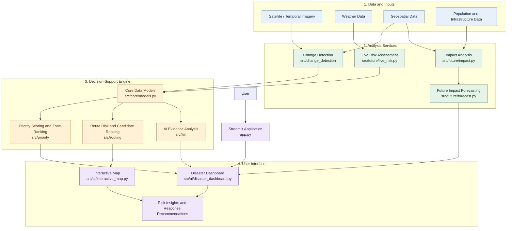

# DisasterLense AI — System Architecture

## Overview

DisasterLense AI is a disaster-response decision-support prototype that combines geospatial analysis, change detection, risk assessment, impact forecasting, and route evaluation to help identify and prioritize areas requiring attention.

## Architecture Diagram

## Main Components

| Component | Responsibility |
|---|---|
| Streamlit application | Application entry point and user-facing workflow |
| Change detection | Analyzes temporal imagery and changes between observations |
| Live risk assessment | Evaluates available weather and risk information |
| Impact analysis | Examines potential effects on people and infrastructure |
| Forecasting | Estimates possible future impacts |
| Priority engine | Scores and ranks areas for response attention |
| Routing engine | Evaluates route candidates and associated risks |
| LLM evidence analysis | Produces AI-assisted analysis grounded in supplied evidence |
| Interactive dashboard | Presents maps, metrics, risk information, and results |

## Data Flow

1. The application receives or loads available disaster-related data.
2. Analysis services process relevant imagery, weather, and geospatial information.
3. Impact and risk outputs feed into prioritization, route evaluation, and AI-assisted evidence analysis.
4. The dashboard presents the resulting information for human review and decision support.

## Important Limitations

- Results depend on the availability, quality, and freshness of the input data.
- Demo datasets and proxy values must not be interpreted as verified real-time disaster measurements.
- Route risk estimates do not independently confirm that a road is currently passable or safe.
- AI-generated analysis should be checked against its supporting evidence.
- The architecture illustrates the intended relationships between project modules; actual execution paths may differ as the implementation evolves.

DisasterLense AI is a decision-support prototype, not a replacement for emergency services or verified official disaster-response systems.
